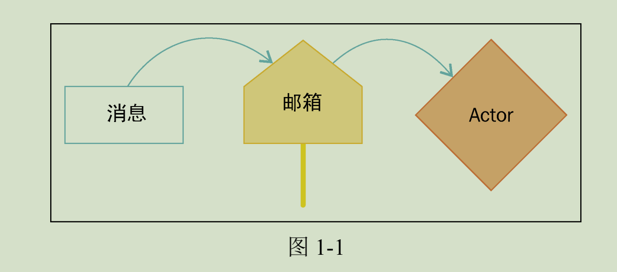
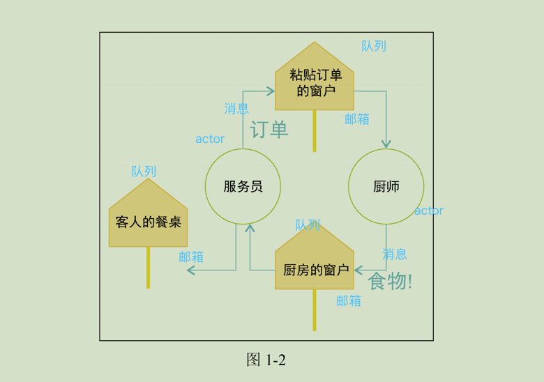
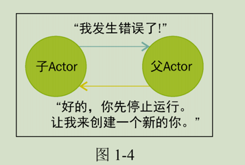

# 第一章：什么是akka?
> 本节将介绍 Akka 和 Actor 模型
```aidl
Akka 一词据说来源于瑞典的一座山，我们说到 Akka时，通常是指一个分布式工具集，用于协调远程计算资源来进行一些工作。Akka 是 Actor
并发模型的一种现代化实现。现在的 Akka 可以认为是从许多其他技术发展演化而来的，它借鉴了 Erlang 的 Actor 模型实现，同时又引入了许多新特性，帮助构建能够处理如今
大规模问题的应用程序。
```

## Actor
> Actor 起源
```aidl
Actor 模型是一种并发计算的理论模型，而 Akka 的核心其实是 Actor 模型的一种实现。Actor 并发模型最早出现于一篇叫作《A Universal Modular Actor Formalism for
Artificial Intelligence》的论文，该论文发表于 1973 年，提出了一种并发计算的理论模型，Actor 就源于该模型。 
```
> 什么是Actor
```aidl
关键词：角色
在 Actor 模型中，Actor 是一个并发原语；更简单 地说，可以把一个 Actor 看作是一个工人，就像能够工作或是处理任务的进程和线程一样。 把 Actor 看成是某个机构中拥有特定职位及职责的员工可能会对理解有所帮助。
```
> Actor 与消息传递
```aidl
关键词：异步传递消息，避免直接接触，产生多线程竞态问题。
在面向对象编程语言中，对象的特点之一就是能够被直接调用：一个对象可以访问或修改另一个对象的属性，也可以直接调用另一个对象的方法。这在只有一个线程进行 这些操作时是没有问题的，但是如果多个线程同时读取并修改同一个值，那么可能就需 要进行同步并加锁。
Actor 和对象的不同之处在于其不能被直接读取、修改或是调用。反之，Actor 只能通过消息传递的方式与外界进行通信。消息传递与方法调用在本质上是不同的：消息传递是异步的。无论是处理消息还是回复消息，Actor 对外界都没有依赖。
```

> Actor 几种重要概念
```aidl
Actor：一个表示工作节点的并发原语，同步处理接收到的消息。Actor 可以保存并修改内部状态。
消息：用于跨进程（比如多个 Actor 之间）通信的数据。
消息传递：一种软件开发范式，通过传递消息来触发各种行为，而不是直接触发行为。
邮箱地址：消息传递的目标地址，当 Actor 空闲时会从该地址获取消息进行处理。
邮箱：在 Actor 处理消息前具体存储消息的地方。可以将其看作是一个消息队列。
Actor 系统：多个 Actor 的集合以及这些 Actor 的邮箱地址、邮箱和配置等。
```

> 竞态条件
[RaceCondition](src/main/scala/chapter01/RaceCondition.scala)

> Java代码中并发Bug
```aidl
大多数 Java 应用程
序都存在大量的并发 Bug，因此有时能正确运行，有时却运行失败。Actor 通过减少共享状态来解决这一问题。如果我们把状态移到 Actor 内部，那么只有该 Actor 才能访问其内部的
状态（实际上只有一个线程能够访问这些内部状态）。如果把所有消息都看做是不可变的，那么我们实际上可以去除 Actor 系统中的所有共享状态，构建更安全的应用程序。
```

```aidl
20 世纪 80 年代，爱立信在 Erlang 语言中实现了 Actor 模型，用于嵌入式电信应用程序。这一实现绝对值得一提。该实现中引入了通过监督机制（Supervision）提供的容
错性概念。爱立信使用 Erlang 和 Actor 模型实现了一款日后经常被提及的应用，叫作AXD301。AXD301 能够提供 99.9999999%的可用性，这一点令人惊叹。相当于在 100 年
中，AXD301 只有 3.1 秒的时间会宕机。AXD 的开发团队表示，他们通过消除共享状态（正如我们之前介绍的一样）并引入 Erlang 中的监督容错机制来达到如此高的可用性。
```