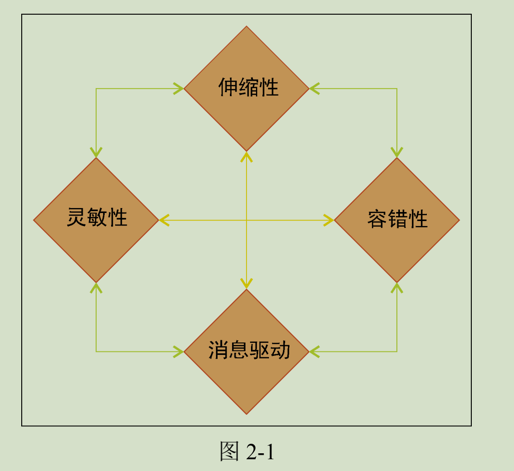
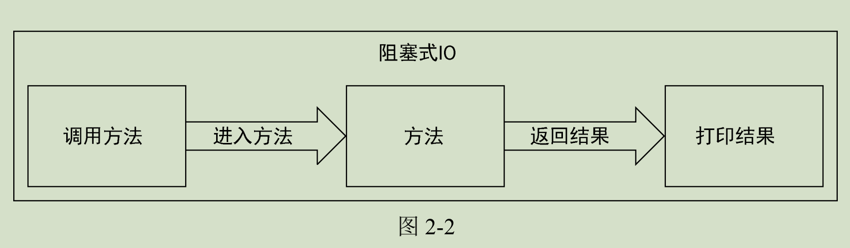
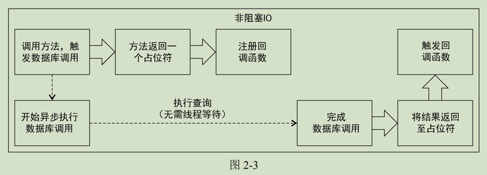

# 第二章：actor与并发

> 本章涉及如下话题：
```aidl
对 Actor 的剖析、Actor 的创建以及与 Actor 的通信；
使用 Akka API 处理异步响应所需的工具和知识；
Future（用于存放将来可能成功或失败的结果）的使用。
```
> 响应式系统设计
```aidl
任何关于 Akka 的书籍都会有关于“响应式”这个术语的描述。Akka 也被称作是一个响应式平台，更具体的说，它是 Typesafe 响应式平台的一部分。
响应式宣言中包含了 4 个准则，或者说是设计目标：灵敏性、伸缩性、容错性以及事件驱动设计。
```

> 灵敏性
```aidl
应用程序应该尽可能快地对请求做出响应。
如果可以在顺序获取数据和并行获取数据之间进行选择的话，为了尽快向用户返回响应，始终应该优先选择并行获取数据，可以同时请求互相没有关联的数据。当我们需
要请求多个互相无关、没有依赖的数据时，应该考虑是否能够同时请求这些数据。如果可能出现错误，应该立即返回，将问题通知用户，不要让用户等待直到超时。
```
> 伸缩性
```aidl
应用程序应该能够根据不同的工作负载进行伸缩扩展（尤其是通过增加计算资源来进行扩展）。为了提供伸缩性，系统应该努力消除瓶颈。如果在虚拟机上运行内存数据库，
那么添加另一个虚拟节点就可以将所有的查询请求分布到两台虚拟服务器上，将可能的吞吐量增加至原来的两倍。添加额外的节点应该能够几乎线性地提高系统的性能。
增加一个内存数据库的节点后，还可以将数据分为两半，并将其中的一半移至新的节点，这样就能够将内存容量提高至原来的两倍。添加节点应该能够几乎线性地提高内存容量。
```
> 容错性
```aidl
应用程序应该考虑到错误发生的情况，并且从容地对错误情况做出响应。如果系统的某个组件发生错误，对与该组件无关的请求不应该产生任何影响。错误是难以避免的，
因此应该将错误造成的影响限制在发生错误的组件之内。如果可能的话，通过对重要组件及数据的备份和冗余，这些组件发生错误时不应该对其外部行为有任何影响。
```
> 事件驱动/消息驱动
```aidl
    使用消息而不直接进行方法调用提供了一种帮助我们满足另外 3 个响应式准则的方法。消息驱动的系统着重于控制何时、何地以及如何对请求做出响应，允许做出响应的
组件进行路由以及负载均衡。
    由于异步的消息驱动系统只在真正需要时才会消耗资源（比如线程），因此它对系统资源的利用更为高效。消息也可以被发送到远程机器（位置透明）。因为要发送的消息暂
存在 Actor 外的队列中，并从该队列中发出，所以就能够通过监督机制使得发生错误的系统进行自我恢复。
```

> 基于Props获取Actor对象引用
```aidl
为了保证能够将 Actor 的实例封装起来，不让其被外部直接访问，我们将所有构造函数的参数传给一个 Props 的实例。Props 允许我们传入 Actor 的类型以及一个变长的参数列表。
val actor: ActorRef = actorSystem.actorOf((classOf[ScalaPongActor],"PongFoo")
优势：对 Actor 构造参数的修改都可以与其他代码隔离，防止在代码修改的过程中引起其他模块的错误。
```
> 获取Actor的方式
```scala
// 直接创建
val xxactorRef = TestActorRef(new XxxActor())

// 通过第三者创建
implicit val system = ActorSystem()
val testProbe = new TestProbe(system)
val xxactorRef = system.actorOf({Props(new PingPongActor)})

// 通过path地址创建
// ActorRef.path akka.tcp://my-sys@remotehost:5678/user/CharlieChaplin
val xxactorRef = system.actorSelection("akka.tcp://actorSystem@host.jason-goodwin.com:5678/user/KeanuReeves");

// 通过指向actor的引用，发送消息
xxactorRef ! SetRequest(key,value)

// 获取引用下面封装的actor对象，从而读取属性内容(只读)
actorRef.underlyingActor

// 借助第三者，往actor发送消息，并接受响应
testProbe.send(xxactorRef,in) // 观察者准备往actor 发送消息，并接受actor返回值
testProbe.expectMsg(out) // 检查消息内容
```
> 阻塞调用
```scala
// 最大问题是阻塞期间未充分利用阻塞线程持有的计算资源
val username = getUsernameFromDatabase(userId)
println(username)
```

>非阻塞调用
```scala
// 异步调用，持有占位符
val future = getUsernameFromDatabaseAsync(userId)
// 注册回调，等待异步线程被激活
future.onComplete(username => 
  //executed somewhere else 
  println(username) 
)
// 主线程继续做其他的时
```
